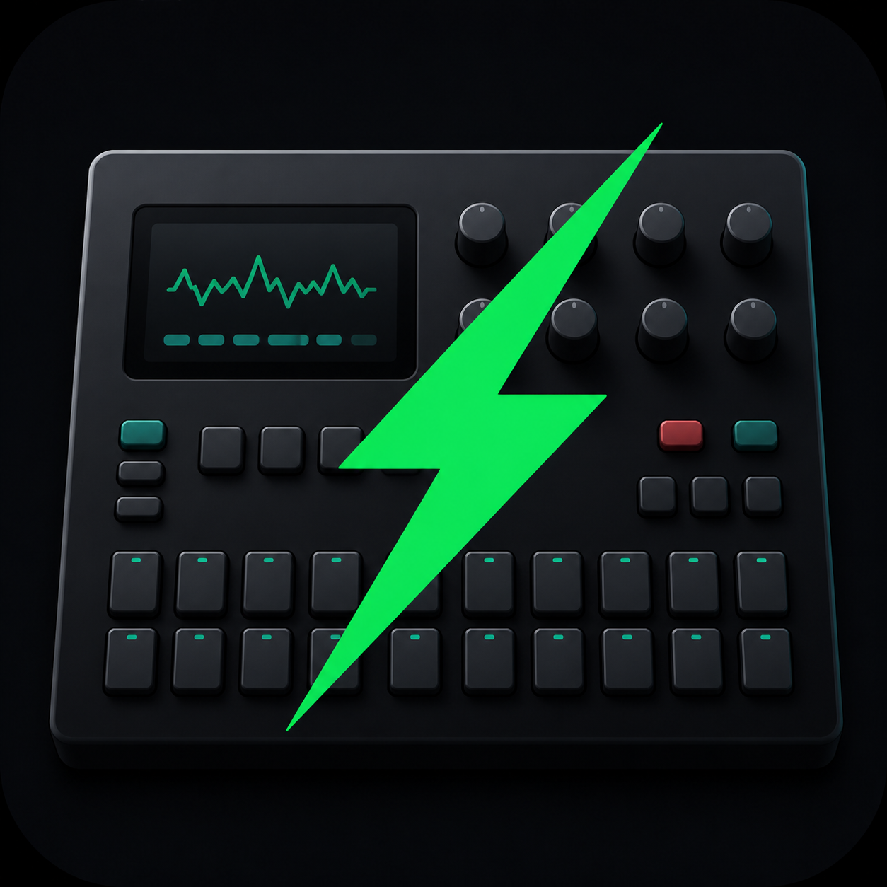
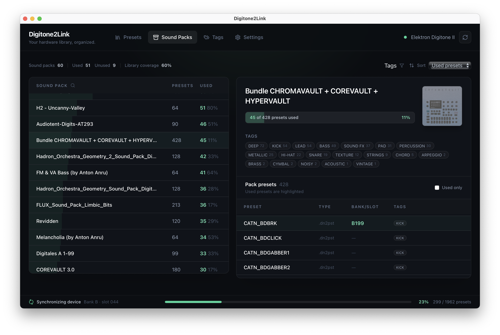
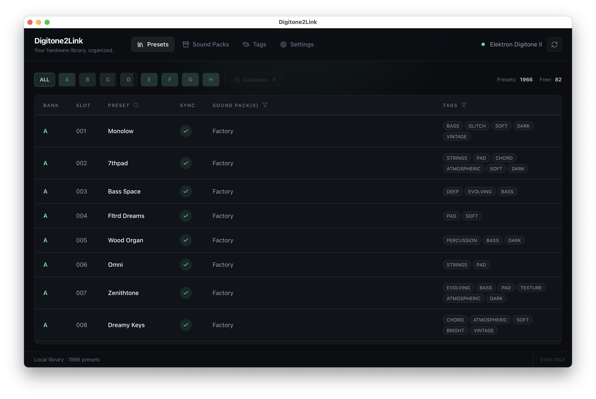
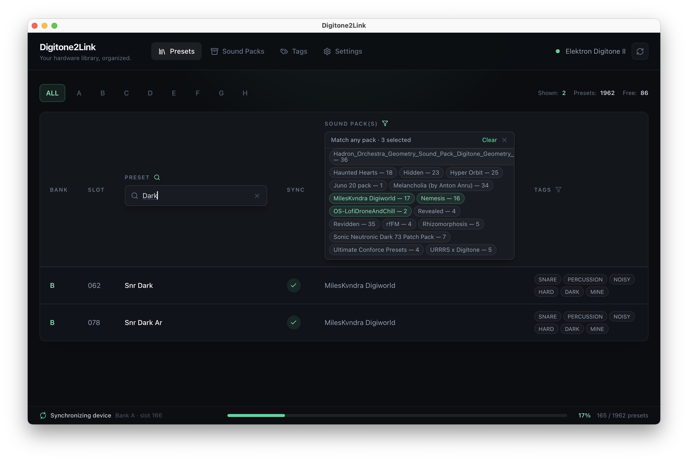
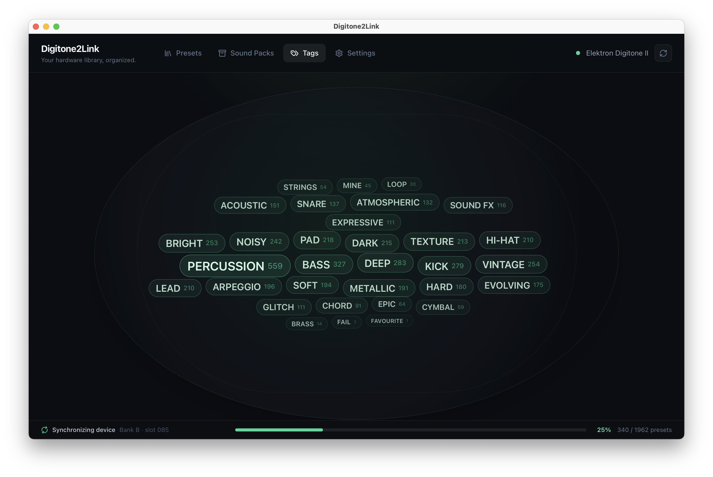
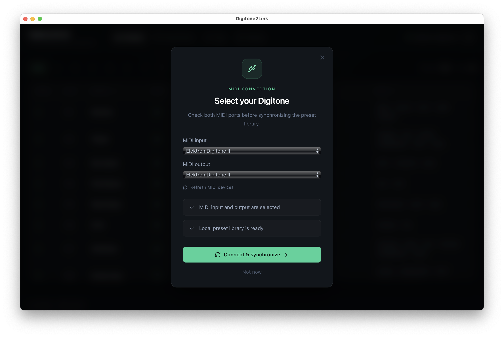
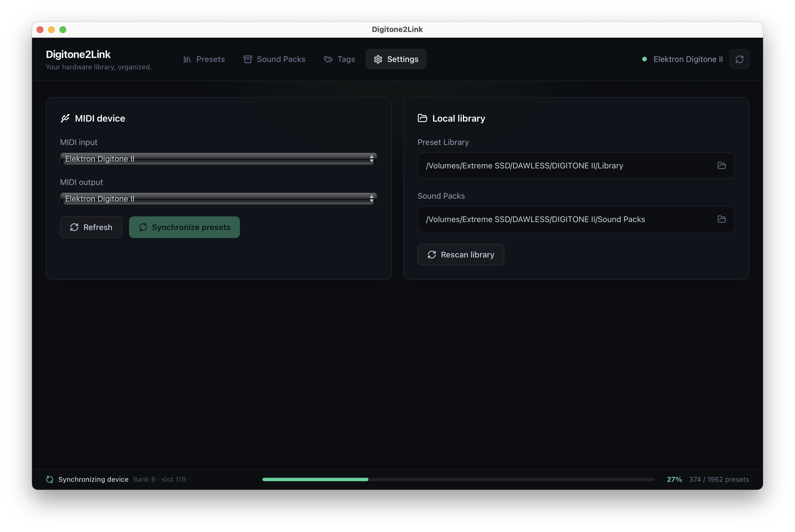

  

<h1 align="center">Digitone2Link</h1>

  A visual preset librarian and sound-pack explorer for the Elektron Digitone II.

  Browse every bank, discover the tags hidden in your collection, and see where your sounds came from — without changing anything on the instrument.

  <a href="https://github.com/enshtein/Digitone2Link/releases/tag/v0.1.3"><strong>Release v0.1.3</strong></a>
  ·
  <a href="https://github.com/enshtein/Digitone2Link/issues">Report an issue</a>

## Download Digitone2Link v0.1.3

| Operating system | Direct download |
| --- | --- |
| **macOS** — Apple Silicon & Intel | [Download Universal DMG](https://github.com/enshtein/Digitone2Link/releases/download/v0.1.3/Digitone2Link_0.1.3_universal.dmg) |
| **Windows** — 64-bit | [Download MSI Installer](https://github.com/enshtein/Digitone2Link/releases/download/v0.1.3/Digitone2Link_0.1.3_x64_en-US.msi) |
| **Linux** — universal | [Download AppImage](https://github.com/enshtein/Digitone2Link/releases/download/v0.1.3/Digitone2Link_0.1.3_amd64.AppImage) |
| **Linux** — Debian / Ubuntu | [Download DEB Package](https://github.com/enshtein/Digitone2Link/releases/download/v0.1.3/Digitone2Link_0.1.3_amd64.deb) |
| **Linux** — Fedora / RHEL | [Download RPM Package](https://github.com/enshtein/Digitone2Link/releases/download/v0.1.3/Digitone2Link-0.1.3-1.x86_64.rpm) |

Other files and release notes are available on the [v0.1.3 release page](https://github.com/enshtein/Digitone2Link/releases/tag/v0.1.3).

## Know what is inside your Digitone II

Digitone2Link connects to your Digitone II over USB MIDI and creates a browsable local copy of its preset library. It brings banks, sound packs, tags, and preset origins together in one clear interface, so you can understand a large collection without searching through the instrument one slot at a time.

The app is designed as a read-only companion: synchronization downloads sounds from the Digitone II and does not overwrite or modify presets on the device.

## Features

- Browse all eight Digitone II banks with their exact bank and slot positions.
- Search presets by name and filter them by sound pack.
- Read preset tags and explore the whole library through an interactive tag cloud.
- Scan folders containing `.dn2pst` and `.dnsnd` sound packs.
- See which packs are represented in your library and how many of their presets are in use.
- Inspect every preset in a pack, including its tags, file type, and matching bank/slot.
- Recognize the built-in Digitone II Factory collection without keeping a separate Factory sound-pack folder.
- Keep a local, human-readable library with preset files organized into banks `A` through `H`.
- Choose MIDI ports, library location, and sound-pack directory independently.
- Run on macOS, Windows, and Linux.

## Explore your preset library

See the complete contents of every bank at a glance. Factory and sound-pack origins appear alongside the preset name, while free slots remain easy to identify.

Search by preset name or narrow the table to a particular sound pack while synchronization continues in the background.

## Understand your sound packs

Digitone2Link scans your sound-pack collection and summarizes how much of each pack is currently represented in the library. Packs can be searched, filtered by tags, and sorted by name, size, or number of used presets.

Select a pack to view its artwork and complete preset list. Used sounds are highlighted and linked back to their bank and slot; clicking a tag filters the presets inside that pack.

## Browse by tags

The Tags view turns metadata from every synchronized preset into a visual map of your collection. Frequently used categories stand out immediately, and selecting a tag opens the matching sounds.

## Getting started

1. Download the current build from [GitHub Releases](https://github.com/enshtein/Digitone2Link/releases/latest).
2. Connect your Digitone II to the computer over USB and enable USB MIDI on the instrument.
3. Open Digitone2Link and select the Digitone II MIDI input and output ports.
4. Choose a **Library Path** for synchronized presets.
5. Optionally choose a **Sound Packs Folder** containing your `.dn2pst` and `.dnsnd` collections.
6. Start synchronization, then browse your banks, packs, and tags.

<table>
  <tr>
    <td width="50%"></td>
    <td width="50%"></td>
  </tr>
  <tr>
    <td align="center">Select the Digitone II MIDI ports</td>
    <td align="center">Choose local library and sound-pack folders</td>
  </tr>
</table>

## Disclaimer

Digitone2Link is an independent community project and is not affiliated with or endorsed by Elektron. Digitone, Digitone II, and Elektron Transfer are trademarks of their respective owner.
